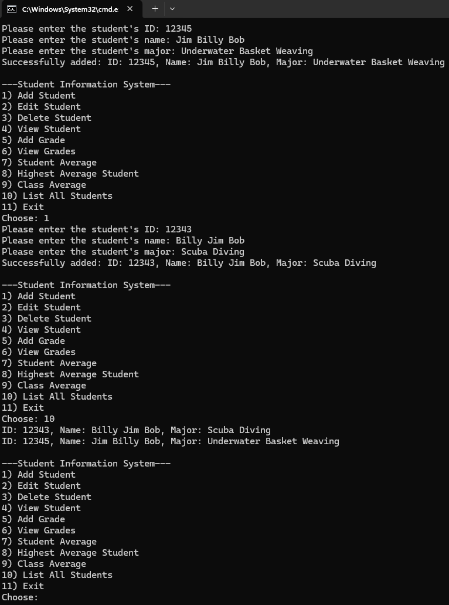

# Student-Information-System
This is my course project for Programming and Data Structures in Java, which stores student objects in a binary search tree and their grades in a custom ArrayList within each student object.

## Table of contents
* [General Info](#General-info)
* [Author](#Author)
* [Programming Approaches](#Programming-approaches)
* [Techologies](#Technologies)
* [Setup](#Setup)
* [Usage](#Usage)
* [Minimum hardware requirements](#Minimum-hardware-requirements)
* [Screenshots](#Screenshots)
* [Project status](#Project-status)
* [Room for improvement](#Room-for-improvement)
* [Release date](#Release-date)
* [Sources](#Sources)
* [Works Cited](#Works-Cited)
* [Acknowledgements](#Acknowledgements)
* [Contact](#Contact)
* [Disclaimer](#Disclaimer)

## General info
- Student Information System (SIS.java) is used to manage student records: add/remove students, view (by ID), edit (name/major), record grades, compute per-student averages, class averages, and find the highest-average student and the average of their grades.
- A Binary Search Tree, StudentBST, stores and manages all Student records keyed by String ID.
- Each student object that instantiates the Student class has its own ArrayList to store that student's grades.

## Author
- Jason Ash, Computer Science Major

## Programming approaches
- In StudentBST, to demonstrate knowledge of recursive methods, its insert, search, delete, and in-order traversal methods are all implemented using recursion.
- The custom ArrayList extends the AbstractList class, and both of these classes implement a List interface (since the interface specifies what methods List classes should have- an example of programming by contract).
- The custom ArrayList also uses generics, but not Comparable or iterator.
- I also followed a suggestion in the third chapter on sorted and unsorted lists in *Object-Oriented Data Structures* by N. Dale, D.T. Joyce, and C. Weems on returning a copy of the object that was gotten or removed from a list to ensure information hiding and better encapsulation. (This is only used in the places where it makes sense to do so and not if it is going to break something downstream).
- The StudentBST's getHeight() method that I went with and that works is based on the one found on stackoverflow.com
- I added guards to check for null in the left and right nodes and to end recursion with the base case that both left and right equal null. The original poster "Michael" had just one method, and I split it into two to have a helper recursive method and to fit the interface of my implementation.
- I also came up with the return statement: return left > right ? 1 + left : 1 + right;.
- The nested if/else structure in the private int countLeaves(Treenode<E> root) helper method is based on the nested if/else statements from this source: https://www.youtube.com/watch?v=7ZWH0ZbUIcs Some of that method I figured out on my own, such as if (root.left == null && root.right == null) return 1;
- I figured out the code for public boolean isFullBinaryTree() and its helper method entirely on my own after writing some pseudo code on a sheet of scratch paper.
- All of the code is in SIS.java with multiple internal classes because this was one of the requirements of the assignment submission.
- Since one of the requirements was to have a recursive inorder() traversal method of the StudentBST using Consumer, I had to look up what java.util.function.Consumer was for this. (Our textbook barely mentioned Consumer).
- I searched Google, and the code for this method is based on its AI search summary, but I use a private helper method, and I checked to see if right or left are null before recursively calling the helper method on them.
- Google's AI said that passing System.out::println as the argument for Consumer<Student> action automatically invokes the toString() method of the Student object.
- I also went with generic E instead of Student.
- I also changed the code that Google AI suggested for Consumer to fit our implementation of BST.
- For the recursive StudentBST delete() method, it is still necessary for the method to know the parent to reattach the tree correctly after deleting a node.
- The SIS class, which has the main() method, interfaces with the StudentManager class, which creates a private StudentBST and interfaces with StudentBST by passing it anonymous Student objects, calling StudentBST methods, or creating an Iterator using the bst.iterator() method.
- The SIS class contains the user interface menu, checks for valid input, handles situations such as student ID not found gracefully, and interfaces with the StudentManager class to add, view, edit, and delete students; add and view grades; and handle other menu functions.
- It is a fairly stable program and doesn't crash with erroneous or out-of-range inputs entered.
- Since the program uses generics (which is a beneficial programming technique), the compiler will complain that SIS.java uses unchecked or unsafe operations (which is just its way of saying it cannot guarantee type casting of objects into their actual type, such as Student).
- There is no way to prevent or suppress this message when using generics, but Java bytecode is still compiled into classes within the directory that SIS.java is saved to, and the program can still be run with the javac command.

## Technologies:
I wrote the source code in Notepad in Windows 11, compiled it in the Command Prompt using the javac command, and ran it using the java command.

## Setup
To compile this .java file into Java bytecode, you can use the command line like I did or your favorite IDE of choice.

## Usage
- After running SIS.java, you can interact with the menu choices by entering the number corresponding to the menu selection you want to perform such as entering 1 to add a student.
- The known bugs are listed under "Room for Improvement" below.

## Minimum hardware requirements
- Although I developed this on a fairly recent Windows 11 PC, this program should run comfortably on any working computer with sufficient processing power, RAM, a monitor manufactured within the past 15-20 years, and an Internet connection to download the .java source files.
- I used JDK version 21 to compile this source code, so your computer will have to be capable of installing and running that version of the JDK and its corresponding built-in JRE.

## Screenshots

## Project status
- This mostly satisfies the requirements of the course project except for the bugs listed below. I don't have time to work on it more right now, and I have probably reached close to my current competency limit with this. So, I'm releasing my solution on GitHub.

## Room for improvement
- After adding the second student, upon adding subsequent students, the program says the student ID is already there. However, the student is still successfully added to the BST and displays when the option to display all students is selected from the menu and when the student is searched for by ID number.
- After adding about three students' grades, the program says the student with the highest average is the last student to have grades entered.

## Release date
19 Aug, 2026

## Sources
- I figured out the code for public boolean isFullBinaryTree() and its helper method entirely on my own after writing some pseudo code on a sheet of scratch paper.
- I wrote the recursive BST insert(E e) method and its recursive helper method on my own after drawing a picture, writing a little pseudocode, and letting my subconscious work on it while I slept.
- I wrote the recursive find() method in StudentBST on my own based on my insert() method.
- I wrote the recursive delete() method in the StudentBST class on my own.
- My implementation for List, AbstractList, and ArrayList closely follows those of the textbook (Liang, 2024).
- The Tree<E> interface that extends Collection closely follows the textbook (Liang, 2024).
- The StudentBST's getHeight() method that I went with and that works is based on the one found on stackoverflow.com
- The nested if/else structure in the private int countLeaves(Treenode<E> root) helper method is based on the nested if/else statements from this source: https://www.youtube.com/watch?v=7ZWH0ZbUIcs
- The compareTo() method in the Student class is based on the syntax of compareTo() in section 21.6 of my textbook (Liang, 2024).
- I searched Google for how to compare a double to Double.NaN for studentAverageUI() in the SIS class, and its AI search summary suggested using Double.isNaN(value).

## Works Cited
- Dale, Nell, Joyce, Daniel T., and Weems, Chip. Object-Oriented Data Structures Using Java. Jones and Bartlett Learning, 2002.

- Google Search, Google, www.google.com/search?q=how%2Bwould%2Byou%2Buse%2BConsumer%2Bin%2Bjava%2Bto%2Bprint%2Bthe%2Belements%2Bin%2Border%2Bin%2Ba%2Bbinary%2Bsearch%2Btree%2Bthat%2Bare%2Bstudent%2Bobjects%2Bthat%2Bhave%2Bthe%2BtoString%2Bmethod%3F&rlz=1C1CHBF_enUS924US924&gs_lcrp=EgZjaHJvbWUyBggAEEUYOdIBCjU1NDMwajBqMTWoAgiwAgHxBaOprLfqSLxa8QWjqay36ki8Wg&sourceid=chrome&ie=UTF-8&udm=50&fbs=ABfTbFVyMZGZf1hfvX9uKjN_-G8cqu7ocb7U6ah0xpkIrGMK4AD-5zQwT5IfpPJ6og2sC2IXdmIqakpXvaGorGwhS-OJs8VccvlD1MGF13c4vQEZ6BOD3Pux5R5lRiN8ciO8Slgl0BUnHh_G26N4HW8fBW4mkNU_voP8HrIeXqVfCc2UPr_YSNPgncxR2WyFnMp5o-T5_iziM1OYX83ka-_PDKYbfe8RNQ&aep=10&ntc=1&mstk=AUtExfD6AbhBbmZUfmrAzZyD8Dr0rjUUmC4WXHZaMVERHqTlZpyli5vWWX_yilihu2gRPjsnyBtL-ey574zQv88_3Hz9miQgF7l2EFqWxB2kMWVMTGkdA3FXdI1iJqn7LOVSilBy2qNkxuqrsQFjloDIBUwP_LjZtOk5e9qaquLJ4VLixVWl8nrz0UE0QtBUClISyv6qZHx6Xyq_UNXzTiyRwOvQnJm0BXZlrMWqxCBGPW_mSSioSasB4T6SdWdtiz7wq6Pa1FMgzUHujgRRQy8epu2d4aKCEzMk9Yyq44uYrpXghvFfUQWtTrKJ61qhK4kCWXFoxpN0DgYu375Gs7ZxUvf-61du1wjMOA&aioh=3&csuir=1&cs=1&atvm=2&mtid=BpNzavndO_jIkPIPuMG28A8. Accessed 5 Aug. 2026.

- Google Search, Google, www.google.com/search?q=how%2Bto%2Bcheck%2Bif%2Ba%2Bdouble%2Bequals%2BDouble.NaN%2Bin%2Bjava&rlz=1C1CHBF_enUS924US924&oq=how%2Bto%2Bcheck%2Bif%2Ba%2Bdouble%2Bequals%2BDouble.NaN%2Bin%2Bjava&gs_lcrp=EgZjaHJvbWUyBggAEEUYOTIHCAEQIRigATIHCAIQIRigATIHCAMQIRigATIHCAQQIRigATIHCAUQIRigATIHCAYQIRiPAtIBCTEyNzg0ajBqN6gCALACAA&sourceid=chrome&source=chrome.ob&ie=UTF-8. Accessed 5 Aug. 2026. 

- Liang, Y. Daniel. Introduction to Java Programming and Data Structures. 13th ed., Pearson Education Limited, 2024.

- Michael. “Java - Finding the Height of the Binary Tree - Stack Overflow.” Stack Overflow, 31 Dec. 2015, stackoverflow.com/questions/34539213/finding-the-height-of-the-binary-tree. Accessed: 02 Aug 2026.

- Stalin S. “Find Number of Leaf Nodes in given Binary Tree.” YouTube, 5 May 2015, www.youtube.com/watch?v=7ZWH0ZbUIcs. Accessed: 03 Aug 2026.

## Acknowledgements
- Prof. Dr. Ibrahim AL-Agha is the project advisor.

## Contact
Jason Ash - wizardofki@gmail.com

## Disclaimer
SIS.java is released under the GNU Public License 3.0. This software and source code are expressly provided "AS IS." I (Jason Ash) MAKE NO WARRANTY OF ANY KIND, EXPRESS, IMPLIED, IN FACT, OR ARISING BY OPERATION OF LAW, INCLUDING, WITHOUT LIMITATION, THE IMPLIED WARRANTY OF MERCHANTABILITY, FITNESS FOR A PARTICULAR PURPOSE, NON-INFRINGEMENT, AND DATA ACCURACY. I NEITHER REPRESENT NOR WARRANT THAT THE OPERATION OF THE SOFTWARE WILL BE UNINTERRUPTED OR ERROR-FREE, OR THAT ANY DEFECTS WILL BE CORRECTED. I DO NOT WARRANT OR MAKE ANY REPRESENTATIONS REGARDING THE USE OF THE SOFTWARE OR THE RESULTS THEREOF, INCLUDING BUT NOT LIMITED TO THE CORRECTNESS, ACCURACY, RELIABILITY, OR USEFULNESS OF THE SOFTWARE.
